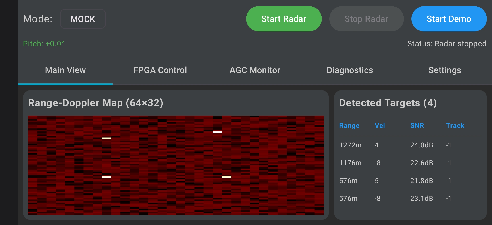

# AERIS-10-Android-UI
Third-party Android UI for AERIS-10

I don't have access to the AERIS-10 hardware, so I need help from the community to test this application. If you encounter any issues or have suggestions, please open a GitHub Issue or contact me by email.

## 📥 Download

Last updated: 2026-07-23

[Download EC-FusionKit-v1.13.6.apk](https://github.com/EmbeddedChan/AERIS-10-Android-UI/raw/main/apk/EC-FusionKit-v1.13.6.apk)

This app is currently not available on Google Play.

## 🖼 UI Preview

## Feedback & Support

Welcome your feedback, feature requests, and bug reports.  
Please email me anytime.

Email: embeddedchan@gmail.com
